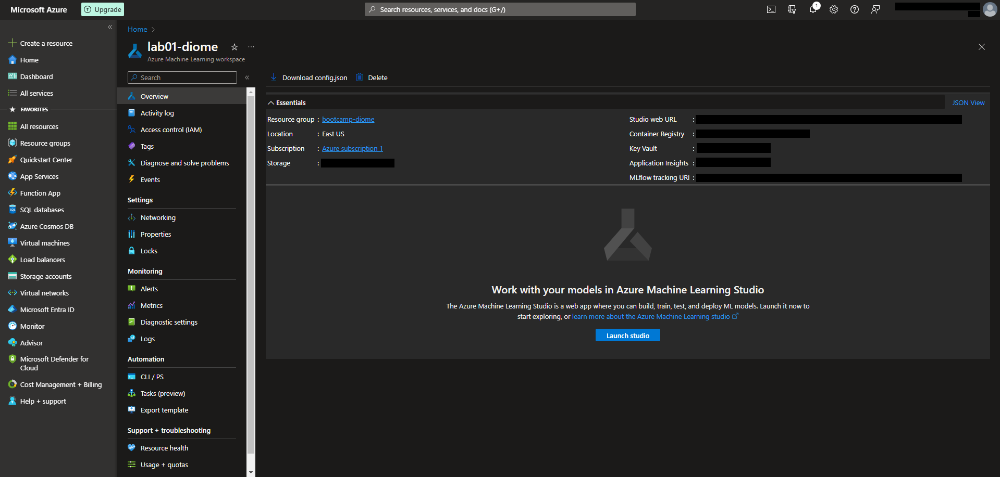
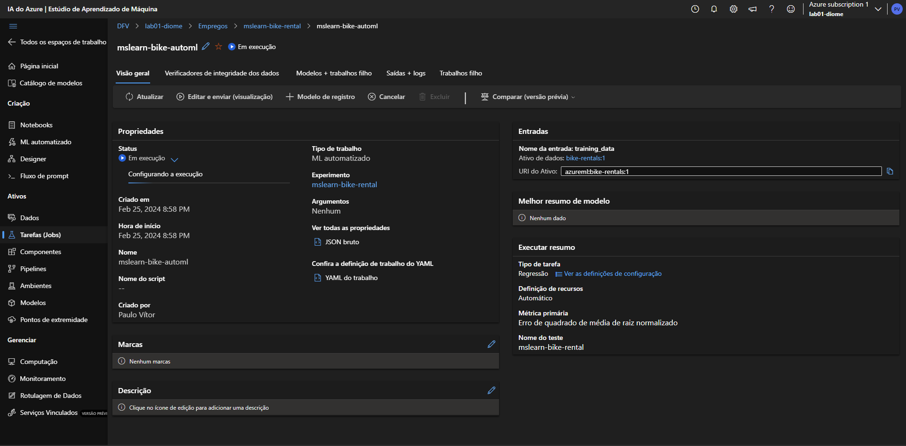
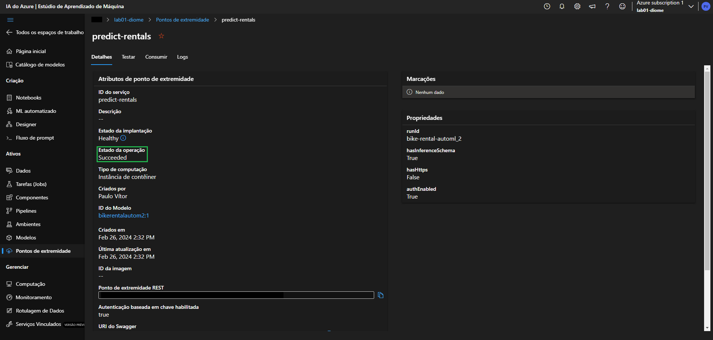
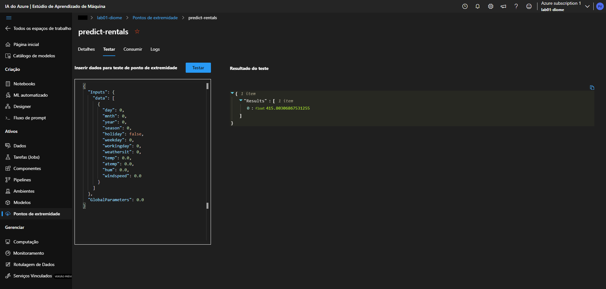

# lab01-ai900
Primeiro laboratório de Machine Learning do bootcamp AI-900, fornecido pela [dio.me](https://web.dio.me/)!

O primeiro contato com a Azure ML está sendo assistido pelo [Microsoft Learn](https://microsoftlearning.github.io/mslearn-ai-fundamentals/Instructions/Labs/01-machine-learning.html).

Será utilizado um conjunto de dados com o histórico dos aluguéis de bicicletas disponibilizado pela empresa [Capital Bikeshare](https://capitalbikeshare.com/).

O portal Azure não é gratuito mas, se fizer o login pela primeira vez, você tem direito à $200.00 de crédito (aproximadamente R$1.000,00) que podem ser usados até 30 dias depois do primeiro acesso.

### Criação da área de trabalho (workspace)
1. Acesse o [Portal Azure](https://portal.azure.com) e entre com a sua conta Microsoft.
2. Crie um novo <b>recurso</b>.
3. Na tela do novo recurso, busque por <b>Azure Machine Learning</b>.
4. Crie um novo workspace e preencha as configurações de acordo com a sua necessidade.
5. Por fim, faça a revisão das opções selecionadas e confirme. Após um curto período de tempo, ele será criado.
6. Após a criação, você terá a opção de iniciar o <b>Machine Learning Studio</b> do Azure.



### Criação do Aprendizado de Máquina Automatizado (Automated Machine Learning)
1. Com o studio iniciado, navegue até o menu <b>ML automatizado</b>.
2. Crie um <b>novo trabalho de ML automatizado</b>.
3. Preencha as configurações básicas.
4. Depois do passo anterior, será pedido para que você preencha as informações de tipo de tarefa e dados. Durante essa etapa, se você ainda não possuir um <b>conjunto de dados (dataset)</b>, será pedido para que você crie.
5. Por fim, será preciso estabelecer as configurações da tarefa criada e o tipo de servidor que será destinado à ela.
6. Faça o envio da sua tarefa para treinamento e aguarde até ela mostrar o status de concluída.



### Implantação (Deploy) do modelo
1. Com o modelo concluído, será possível ter acesso ao algoritmo que teve maior precisão após o treinamento.
2. Entre no algoritmo e, na opção <b>Implantar</b>, selecione <b>Serviço Web</b>.
3. Preencha as configurações como necessário e prossiga com a implantação.
4. Aguarde até que a implantação seja iniciada. Quando iniciado, o status será indicado como "Em execução".
5. Depois de um certo tempo, o status será automaticamente atualizado para "Concluído". O processo demora em torno de 10-15 min.



### Teste do serviço implantado
1. Ao finalizar o tópico anterior, você terá automaticamente criado um <b>Ponto de Extremidade</b>. Dentro dele será possível acessar à opção <b>Testar</b>.
2. Nessa opção, impute o seguinte código para teste:
```
 {
   "Inputs": { 
     "data": [
       {
         "day": 1,
         "mnth": 1,   
         "year": 2022,
         "season": 2,
         "holiday": 0,
         "weekday": 1,
         "workingday": 1,
         "weathersit": 2, 
         "temp": 0.3, 
         "atemp": 0.3,
         "hum": 0.3,
         "windspeed": 0.3 
       }
     ]    
   },   
   "GlobalParameters": 1.0
 }
```
3. Clique na opção <b>Testar</b> e observe à direita o resultado obtido. Segundo a Microsoft, o resultado deve ser próximo à 444.28
```
 {
   "Results": [
     444.27799000000000
   ]
 }
```
<p>Lembre-se que o resultado pode variar, como ocorreu comigo: </p>



<p> <b>Em resumo:</b> Foi criado um conjunto de dados com o histórico dos aluguéis de bicicletas e ele foi usado para o treinamento de um modelo. Por fim, o modelo conseguiu prever o número de bicicletas que seriam alugadas em um determinado dia, considerando até mesmo as condições meteorológicas e das estações.</p>
