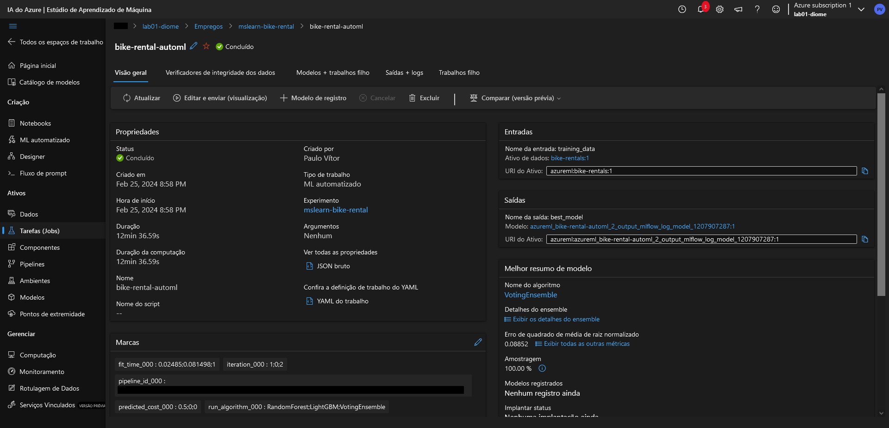

# lab01-ai900
 Primeiro laboratório de Machine Learning do bootcamp AI-900, fornecido pela [dio.me](https://web.dio.me/)!

O primeiro contato com a Azure ML está sendo assistido pelo [Microsoft Learn](https://microsoftlearning.github.io/mslearn-ai-fundamentals/Instructions/Labs/01-machine-learning.html).

Será utilizado um conjunto de dados com o histórico dos aluguéis de bicicletas disponibilizado pela empresa [Capital Bikeshare](https://capitalbikeshare.com/).

O portal Azure não é gratuito mas, se fizer o login pela primeira vez, você tem direito à $200.00 de crédito (aproximadamente R$988,00) que podem ser usados até 30 dias depois do primeiro acesso.

### Criação da área de trabalho (workspace)
1. Acesse o [Portal Azure](https://portal.azure.com) e entre com a sua conta Microsoft.
2. Crie um novo recurso.
3. Na tela do novo recurso, busque por <b>Azure Machine Learning .
4. Crie um novo workspace e preencha as configurações de acordo com a sua necessidade.
5. Por fim, faça a revisão das opções selecionadas e confirme. Após um curto período de tempo, ele será criado.
6. Após a criação, você terá a opção de iniciar o studio de ML do Azure.

### Criação do Aprendizado de Máquina Automatizado (Automated Machine Learning)
1. Com o studio iniciado, navegue até o menu ML automatizado.
2. Crie um novo trabalho de ML automatizado.
3. Preencha as configurações básicas.
4. Depois do passo anterior, será pedido para que você preencha as informações de tipo de tarefa e dados. Durante essa etapa, se você ainda não possuir um conjunto de dados (dataset), será pedido para que você crie.
5. Por fim, será preciso estabelecer as configurações da tarefa criada e o tipo de servidor que será destinado à ela.
6. Faça o envio da sua tarefa para treinamento e aguarde até ela mostrar o status de concluída.

### Deploy e teste
1. Com o modelo concluído, será possível ter acesso ao algoritmo que teve maior precisão após o treinamento.
2. Entre no algoritmo, focalize na opção Implantar (Deploy) e selecione Serviço Web.
